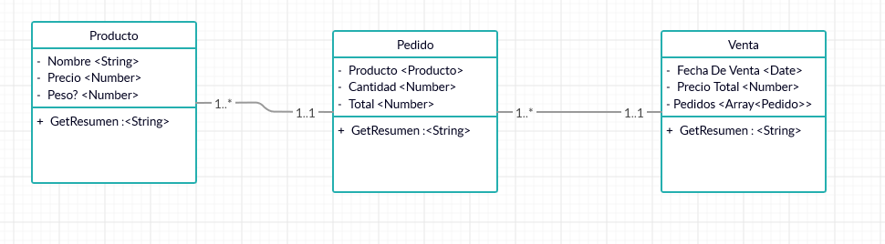

# Practicando Poo

## Instrucciones

Reutilizando el codigo de la clase anterior,desarrollar un CRUD por consola (Investigar el signifiacado, aunque ya fue mencionado) siguiento las siguientes anotaciones:

**Ojo**
Los atributos y metodos siguen siendo los mismos, en este archivo solo se enlistan las propiedades o metodos que han cambiado o se han agregado.

**Todas las clases deben seguir correctamente el estandar de encapculación**

## Detalle de clases

- ### Producto
  - **Atributos**
    - Nombre -- String
    - Precio -- Number
    - Peso -- Number
  - **Metodos**
    - GetResumen -- Devuelve una string con el siguiente formato: Nombre Peso Precio
      Ejemplo: Chocolate carlos quinto 4g \$10
- ### Pedido
  - **Atributos**
    - PedidoId -- Number
    - Total -- Number
      **Nota**
      El total debe calcularse en base al precio del producto correspondiente al pedido **_pista:_** Se debe hacer un metodo para poder obtener el precio del producto
- ### Venta
  - **Atributos**
    - Pedidos -- Array.Pedido
      **Nota**
      Es un **array jaja** que puede o no estar vacio despues de que creas una instancia **_pista:_** Cuando creas el constructor asignale por default un valor
    - PrecioTotal -- Number
      **Nota**
      NO se pasa como parametro al constructor sino que se calcula con la la propiedad de cada pedido **_pista:_** crear en la clase Pedido un metodo para obtener el puro Total del pedido tambien recorrer el array de Pedidos y utilizar el metodo previamente creado para obtener cada total
  - **Metodos**
    _"Aquí viene lo bueno" jejeje_
    - addPedido --Recive un _Pedido_ y lo inserta a el array de la propiedad _Pedidos_
    - updatePedido --Recive un _Pedido_ y lo compara con los _Pedido_ de la propiedad _Pedidos_ y en el que coincida con su PedidoId se remplaza **_pista:_** Debes recorrer el array de _Pedidos_ y comparar cada _PedidoId_
    - deletePedido --Recive un numero que equivale a un _PedidoId_ y debe eliminar el _Pedido_ que coincida en la propiedad _Pedidos_
